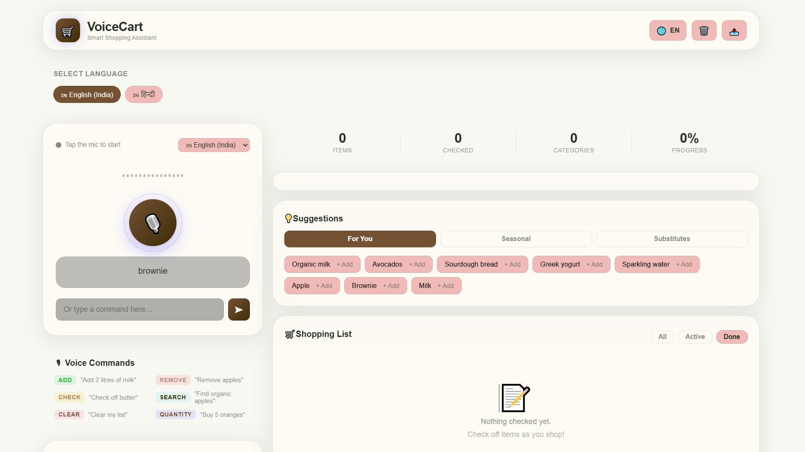
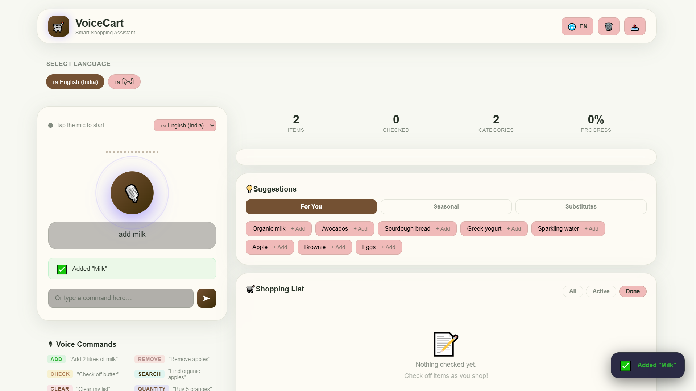
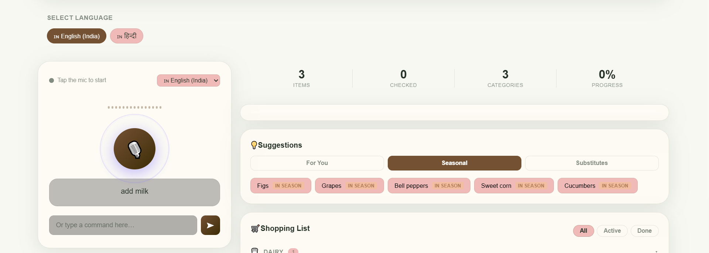
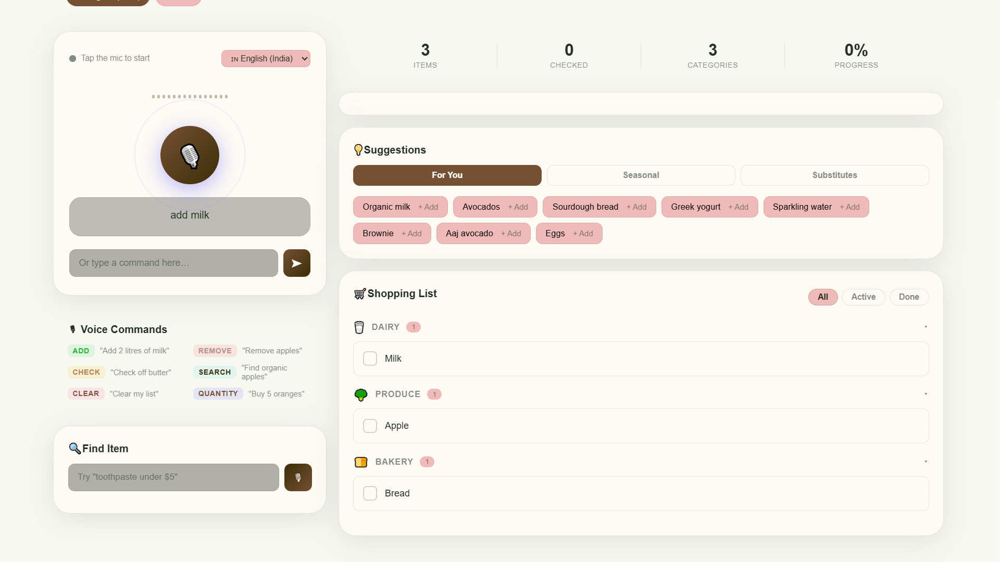
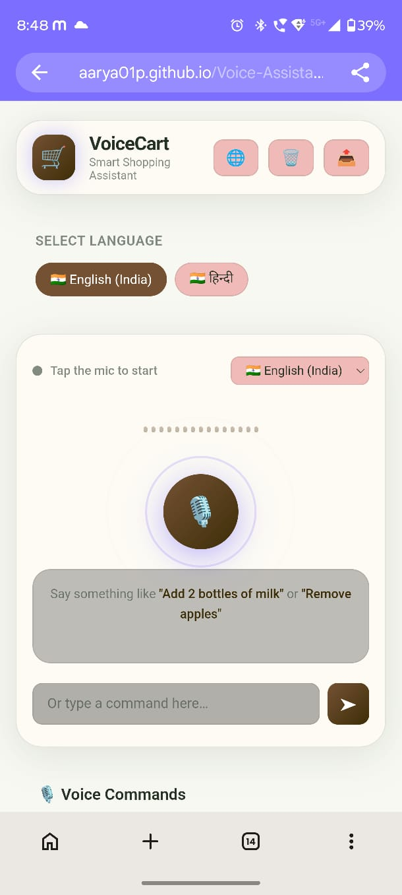

# VoiceCart 🛒

VoiceCart is a voice-controlled shopping list assistant that lets users manage their shopping list using natural voice commands or text.

I built this project as a technical assessment to explore voice interaction and lightweight NLP without using a backend or paid AI APIs.

## 🌐 Live Demo

**Application:**  
https://aarya01p.github.io/Voice-Assistance-Shopping/

**GitHub:**  
https://github.com/Aarya01p/Voice-Assistance-Shopping/

> Chrome or Edge is recommended for voice features. Allow microphone access when prompted.

---

## 📸 Screenshots

### Main Interface


### Voice Commands


### Smart Suggestions


### Shopping List


## Mobile Interface


---

## ✨ Features

- 🎙️ Add, remove, modify, and check items using voice commands
- 🧠 Lightweight NLP using JavaScript, keywords, and regular expressions
- 📦 Automatic item categorization
- 🔢 Quantity and unit detection
- 💡 Suggestions based on shopping history, seasonal items, and substitutes
- 🔎 Voice and text-based product search
- 🌍 English and Hindi voice support
- 📱 Responsive desktop and mobile interface
- 💾 Local storage for shopping data and history
- 📡 Offline shopping-list functionality after the initial load
- 📤 Share or copy the shopping list
- 📲 PWA support

---

## 🎙️ Example Commands

```text
"Add milk"

"I need two apples"

"Buy 5 oranges"

"Remove milk"

"Check off bread"

"Find organic apples"

"Find toothpaste under 5 dollars"
````

---

## 🧠 How It Works

The Web Speech API converts voice input into text. A lightweight NLP parser then identifies the intent, item, quantity, and unit using keywords and regular expressions.

For example:

```text
"Add 2 bottles of water"

        ↓

Intent: ADD
Quantity: 2
Unit: bottles
Item: water
```

The command is then processed by the shopping-list logic and the UI is updated immediately.

Smart suggestions use shopping history, seasonal data, and predefined product alternatives.

---

## 🛠️ Tech Stack

* HTML5
* CSS3
* JavaScript
* Web Speech API
* LocalStorage
* Service Worker / PWA
* Web Share API
* GitHub Pages

---

## 📁 Project Structure

```text
Voice-Assistance-Shopping/
│
├── index.html
├── styles.css
├── app.js
├── sw.js
├── manifest.json
├── screenshots/
└── README.md
```

---

## ▶️ Run Locally

Clone the repository:

```bash
git clone https://github.com/Aarya01p/Voice-Assistance-Shopping.git
cd Voice-Assistance-Shopping
```

Start a local server:

```bash
python -m http.server 8080
```

Then open:

```text
http://localhost:8080
```

You can also use VS Code Live Server.

---

## 📱 Browser Support

Chrome and Edge are recommended because voice recognition uses the Web Speech API.

Firefox does not currently provide the same level of voice-recognition support, but text input can still be used.

The deployed version uses HTTPS, allowing microphone access in supported browsers.

---

## 🔮 Future Improvements

* Real-time product data through a public API
* Barcode scanning
* Cloud synchronization
* Multiple shopping lists
* More language support
* More personalized recommendations

---

## 👩‍💻 Author

**Aarya Patel**
Computer Science & Engineering — AI & Machine Learning

## 📄 License

MIT
